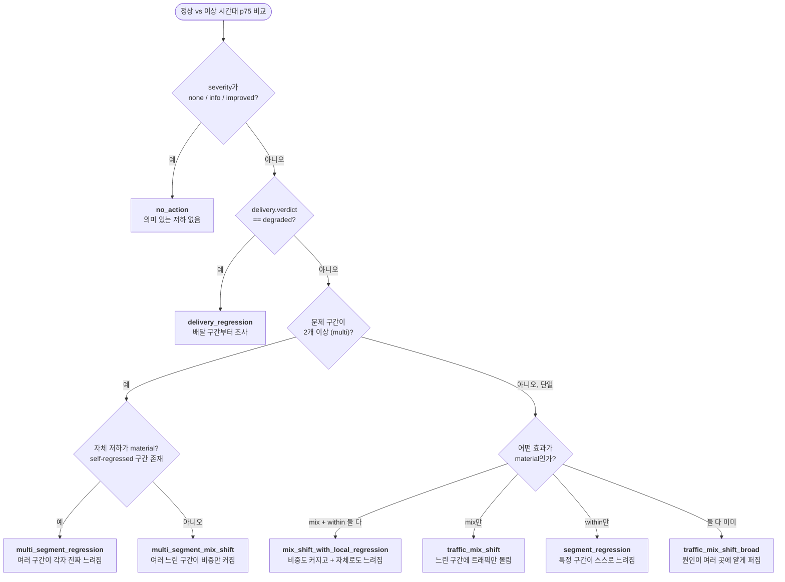

# v6 리포트 판정 로직 (Verdict & Recommended Actions)

이 문서는 v6 파이프라인(`pipeline.py`)이 이상 리포트에서 **판정(verdict)**과
**권장 조치(Recommended Actions)**를 **어떻게 자동으로 선택**하는지 설명합니다.
두 가지 모두 LLM이 지어내는 것이 아니라 **결정론적 규칙**으로 정해지며, LLM은
정해진 내용을 고객용 문장으로 다듬기만 합니다.

## 1. 큰 그림 — 숫자가 오르는 이유는 2가지

파이프라인은 **"정상 시간대" vs "이상 시간대"** 두 구간의 페이지 로딩 시간(p75)을
비교합니다. 숫자가 올라갔을 때 근본 원인은 둘 중 하나(또는 둘 다)입니다.

| 원인 | 뜻 | 마트 비유 |
|---|---|---|
| **① 구성 변화 (mix)** | 사이트가 실제로 느려진 게 아니라, 원래 느린 페이지로 트래픽이 더 몰림 | 느린 계산대에 손님이 더 줄 섬 |
| **② 자체 저하 (within / regression)** | 같은 페이지가 스스로 진짜 느려짐 (진짜 성능 문제) | 계산원 자체가 느려짐 |

판정은 결국 **"이 둘 중 무엇이, 몇 개 구간에서 일어났나"**를 분류하는 이름표입니다.

## 2. 판정에 쓰는 재료

`select_verdict()`가 읽는 신호들:

| 재료 | 쉬운 뜻 |
|---|---|
| **severity** | 변화가 애초에 의미 있을 만큼 큰가? (작으면 무시) |
| **delivery.verdict** | CDN/원본서버 배달 구간(edgetime·origintime 등)이 나빠졌나? |
| **mix_material** | ① 구성 변화 효과가 무시 못 할 만큼 큰가 |
| **within_material** | ② 자체 저하 효과가 무시 못 할 만큼 큰가 |
| **focus 개수 (multi)** | 문제 구간이 1개냐, 2개 이상이냐 |
| **coverage** | 지목한 구간들이 전체 변화를 다 설명하는가 |

> **material("유의미")의 뜻**: 효과가 절대 기준값(`abs_floor_ms`)과 상대 기준값
> (`rel_floor`)을 **둘 다** 넘어야 "진짜 효과"로 인정됩니다. 찔끔한 효과는 버립니다.

## 3. 판정 흐름도

위에서부터 순서대로 내려가며 **처음 걸리는 조건**이 판정이 됩니다.

> **coverage 참고**: 지목한 구간이 전체 변화를 다 설명하지 못하면(`coverage < 100%`)
> "일부 미설명분 있음" 문구만 덧붙고 **판정 코드는 바뀌지 않습니다.**

## 4. 판정 코드 요약

| 코드 | 무슨 상황인가 | 걸리는 조건 |
|---|---|---|
| **no_action** | 의미 있는 저하 없음 (극단값 몇 개가 평균만 부풀렸을 수 있음) | severity = none/info/improved |
| **delivery_regression** | CDN/원본 배달 구간이 나빠짐 → 여기부터 조사 | delivery = degraded |
| **multi_segment_regression** | 여러 구간이 각자 진짜 느려짐 | 문제구간 ≥2 **그리고** 자체저하 material |
| **multi_segment_mix_shift** | 여러 느린 구간이 비중만 커짐 (나머지는 멀쩡) | 문제구간 ≥2, 자체저하 미미 |
| **mix_shift_with_local_regression** | 한 구간이 비중도 커지고 + 자체로도 느려짐 | 문제구간 1, mix·within **둘 다** material |
| **traffic_mix_shift** | 느린 구간에 트래픽만 몰림 (진짜 느려진 건 아님) | 문제구간 1, **mix만** material |
| **segment_regression** | 특정 구간이 스스로 느려짐 (구성으로 설명 안 됨) | 문제구간 1, **within만** material |
| **traffic_mix_shift_broad** | 원인이 여러 곳에 얕게 퍼짐 (단일 주범 없음) | 문제구간 1, mix·within **둘 다** 미미 |

## 5. Recommended Actions — 어떻게 선택되나

권장 조치도 LLM이 지어내지 않습니다. **규칙 기반 플레이북 매칭**으로 정해지고 LLM은
문장만 다듬습니다.

### 흐름

1. **플레이북 정의** (`playbook.py`의 `AKAMAI_PLAYBOOK`): 조치 후보들이 "데이터"로
   들어있습니다. 각 항목 = `applies_to`(적용 메트릭) + `when`(조건들) + `levers`(Akamai
   기능) + `action`(문장 원본) + `scope_tag`.
2. **매칭** (`match_playbook`): 각 항목에 대해 — ① 현재 메트릭이 `applies_to`에 있고,
   ② `when`의 **모든** 조건이 참이면 선택 → `findings["remediation_playbook"]`.
   조건 문법은 단순 4종: `a.b == x`, `a.b > n`, `a.b < n`, `a.b in x,y,z`.
3. **LLM은 문장만 재작성**: 프롬프트가 *"Recommended Actions는 오직
   remediation_playbook의 action만 사용하고, 새 조치를 지어내지 말 것"*을 강제.
4. **스코프 가드**: `check_recommendation_scope`가 플레이북 밖 조치를 발견하면 draft를
   거부하고 재시도. critic 패스도 out-of-scope를 감시. LLM이 끝내 실패하면
   `render_fallback_report_v5`가 **같은 플레이북 action을 결정론적으로 삽입**.

즉 판정(verdict)이 플레이북 조건에 그대로 들어가 **"원인 → 대응"**이 자동 연결됩니다.

### 플레이북 항목 (요약)

| id | 언제 켜지나 (`when`) | 적용 메트릭 | Akamai lever |
|---|---|---|---|
| `ivm_hero_cold_cache` | verdict ∈ (mix-shift 계열) **AND** 신규방문자 유입 | lcp, fcp | Image & Video Manager, EdgeWorkers(LCP preload) |
| `prefetch_event_landing` | 신규방문자 유입 **AND** 랜딩 진입비중 > 70% | lcp, fcp, ttfb | EdgeWorkers(Early Hints), Adaptive Acceleration |
| `offload_regional_origin` | delivery = clean **AND** 자체저하 있음 | lcp, fcp, ttfb | Tiered Distribution, Cloud Wrapper |
| `delivery_investigate` | delivery = degraded | lcp, fcp, ttfb, tbt | mPulse + DataStream 2, 원본 health/offload |
| `alert_segmentation` | verdict ∈ (mix-shift 계열) | 전체 | mPulse 알림 분리(page-group/geo) |
| `third_party_release_audit` | 자체저하(within_regression) 있음 | 전체 | Script Management, 릴리스 변경 상관분석 |
| `reduce_main_thread_blocking` | verdict ∈ (mix-shift 계열 + segment_regression) | tbt | Script Management(defer/async), EdgeWorkers |

> *mix-shift 계열* = `traffic_mix_shift`, `multi_segment_mix_shift`,
> `mix_shift_with_local_regression`, `multi_segment_regression`.

### 예 (지난 테스트 실행)

findings가 `delivery = degraded`, `within_regression = true`, metric = lcp였고, 그 결과:

- **`delivery_investigate`** (조건 `delivery.verdict == degraded`) → "배달 경로 회귀
  조사: DataStream 2로 원본 응답·오프로드 상관분석"
- **`third_party_release_audit`** (조건 `within_regression == true`) → "최근 릴리스/
  서드파티 태그 변경 점검, 두 구간 리소스 워터폴 비교"

두 조치가 자동 선택됐습니다. 반면 `ivm_hero_cold_cache`·`alert_segmentation`은
`verdict ∈ (mix-shift 계열)`을 요구하는데 실제 verdict가 `no_action`이라 탈락했습니다.

## 6. 새 조치를 추가/수정하려면

코드 변경 없이 **`playbook.py`의 `AKAMAI_PLAYBOOK` 리스트에 항목 하나를 추가**하면
됩니다(조건 predicate + action 문장 + levers + scope_tag). 매칭·검증·폴백이 모두
데이터 기반이라 자동으로 반영됩니다.
